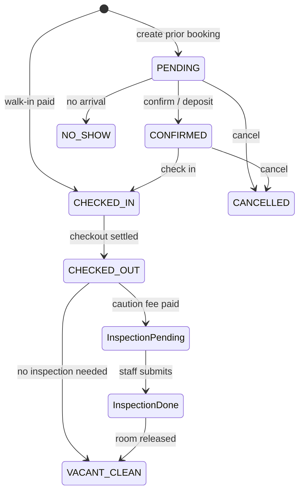
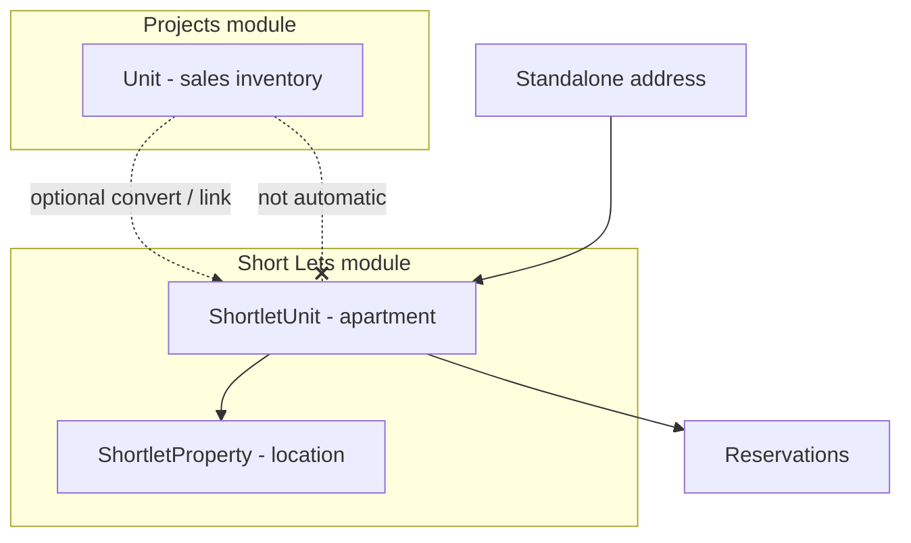
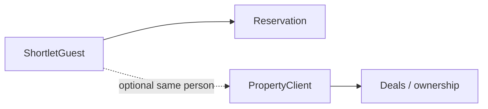
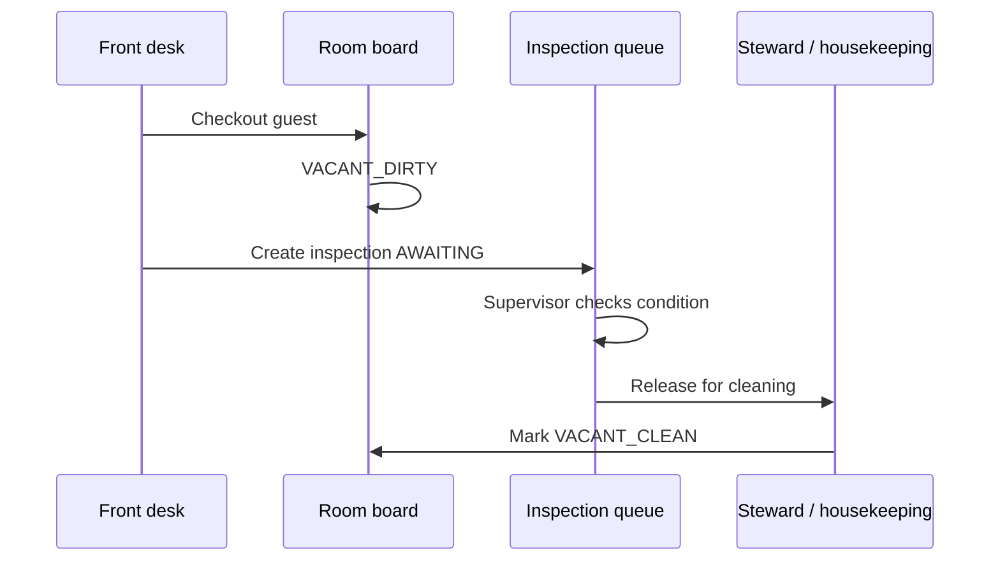
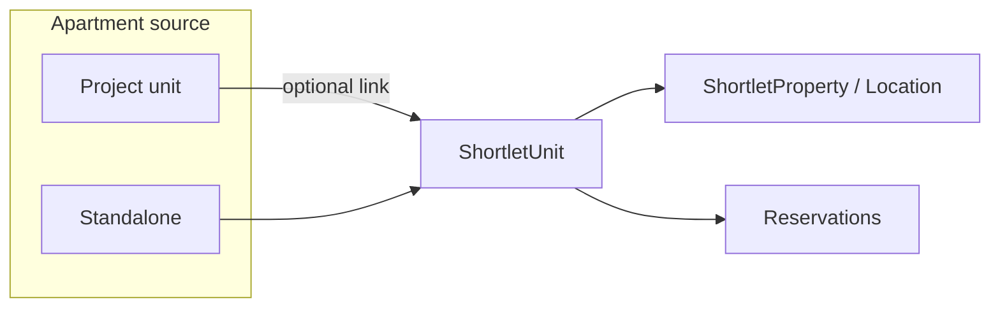
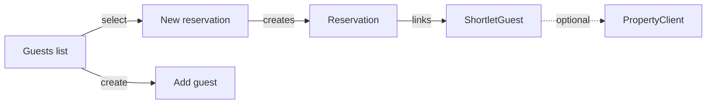

# Short Lets expansion — structure map

Reference: Lodgr (competitor screenshots, Jun 2026).  
Goal: expand Realcorp Short Lets without losing what we already built.

---

## Terminology (Realcorp ↔ competitor)

| Lodgr | Realcorp (keep / use) |
|-------|------------------------|
| Bookings | **Reservations** (same thing — keep our name in UI) |
| Apartments | **Shortlet units** (inventory — move out of Settings) |
| Locations | **Shortlet locations** (branch / site — expand `ShortletProperty`) |
| Guests | **Shortlet guests** (`ShortletGuest` — not PropertyClient) |
| Checkout inspections | **Checkout inspections** → inspection queue, then steward cleaning |
| Caution fee | **Deposit** — default on apartment + override per reservation |

---

## What we have today

### Nav (`shortlets-subnav.tsx`)

| Page | Purpose |
|------|---------|
| Front desk | Arrivals, departures, walk-in, checkout settlement |
| Room board | Housekeeping status per unit |
| Reservations | List + calendar, create reservation, guest bill link |
| Channels | OTA / lead import → reservation |
| Guest bill | Post folio charges (F&B, laundry, etc.) |
| Reports | Night audit, in-house list, exports |
| Settings | **Operations** (times, EOD), **Inventory** (properties + units), **Catalog** (service items) |

### Data (`prisma`)

| Model | Notes |
|-------|--------|
| `ShortletProperty` | Name + address only — **too thin for “locations”** |
| `ShortletUnit` | Optional `projectUnitId`, optional `propertyId`, rates, housekeeping |
| `ShortletReservation` | Guest inline fields + optional `guestClientId`; statuses: RESERVED, CHECKED_IN, CHECKED_OUT, CANCELLED |
| `PropertyClient` | Sales/investor clients — **separate domain** from hotel guests |
| `ShortletGuest` | **NEW** — short-stay guest CRM (optional `propertyClientId` only if same person) |
| — | Reservation statuses expanded; caution fee on unit + booking; checkout inspections |

---

## Locked product decisions (Jun 2026)

1. **ShortletGuest ≠ PropertyClient** — different people, different workflows. Never merge. Optional cross-link only when the same person is both a sales client and a repeat guest.

2. **Shortlet ≠ Project unit** — A inventory **Unit** in Projects is for sales/long-term ownership. A **ShortletUnit** (apartment) is hospitality inventory. They are independent:
   - Shortlet can exist **with no project and no unit link** (standalone property you manage or own elsewhere).
   - Shortlet **may optionally** link to a project unit when an owner wants to **convert** that unit to short-let operations (`projectUnitId` is a conversion bridge, not a requirement).
   - Linking does **not** make every project unit a shortlet automatically.

3. **Reservation statuses:** `PENDING` → `CONFIRMED` → `CHECKED_IN` → `CHECKED_OUT`; plus `CANCELLED`, `NO_SHOW`. Legacy `RESERVED` maps to `CONFIRMED`.

4. **Caution fee:** default on **ShortletUnit** + per-**reservation** override (`cautionFee`, `cautionFeePaid`). Separate from `cleaningFee` (operational cleaning charge).

5. **Checkout → inspection → cleaning flow:**
   - Guest checks out → room **VACANT_DIRTY** + **inspection record** created (awaiting steward/supervisor).
   - Staff inspects: room condition good / damages / needs maintenance; caution refund or deduction.
   - After inspection passed → **stewards clean** → room board marked **VACANT_CLEAN** → available for next guest.

6. **Investor visibility:** Investors/listing owners with portal access should see **short-let activity** for assets they have stake in:
   - Linked shortlet → via `projectUnitId` → project stakeholders (existing portal).
   - Standalone shortlets → future **ShortletUnit stakeholder** link (Phase 6) for investors not tied to a sales unit.

---

## Target information architecture

Reorganize Short Lets into **groups** (sidebar-style subnav or nested sections):

```
Short Lets
├── Front desk
│   ├── Calendar              ← reservations calendar (promote from tab)
│   ├── Reservations          ← list + KPIs + export (bookings)
│   ├── Check in / out        ← today’s ops (split from front-desk or keep unified)
│   ├── Guests                ← NEW dedicated CRM list
│   └── Checkout inspections  ← NEW post-checkout queue
│
├── Inventory                 ← move out of Settings
│   ├── Apartments (units)    ← full CRUD + link-from-project
│   └── Locations             ← expandedHelp / HQ sites
│
├── Channels                  (keep)
├── Guest bill (folio)        (keep)
├── Room board                (keep — housekeeping)
├── Reports                   (keep + booking analytics later)
└── Settings                  (slim: operating times, policies, finance sync, catalog)
```

---

## Screen-by-screen map (competitor → Realcorp)

### 1. Reservations / Bookings list

**Their UI:** KPI row (Total, Pending, Confirmed, Checked In, Checked Out, No Shows), search, status + date filters, export CSV, empty state CTA.

**We have:** List + calendar toggle, export menu, basic status on rows.

**Gap / build:**

- [ ] KPI stat cards on reservations index
- [ ] Status filters: add **PENDING**, **CONFIRMED**, **NO_SHOW** (extend enum or map from current flow)
- [ ] Search: guest name, unit, booking reference
- [ ] Date range filter
- [ ] Human-readable **booking reference** (`SL-…` or similar)
- [ ] “Create first reservation” empty state (already partial)

---

### 2. New reservation form

**Their UI:**

- Booking type: **Prior booking** vs **Walk-in** (walk-in = pay before check-in policy)
- Guest: **select existing guest** or **+ New guest**
- Apartment: **single** vs **multiple** (phase 2)
- Check-in / check-out dates
- **Pricing panel:** consumption tax, VAT, discount, total, caution fee
- **Payment panel:** booking amount paid, caution fee paid, payment method
- Walk-in: “Check in immediately after booking”
- Notes

**We have:** Modal with unit, guest name/email/phone, dates, walk-in on front desk only; tax/discount/caution not broken out.

**Gap / build:**

- [ ] Full-page or large modal **New reservation** (match competitor layout)
- [ ] Booking type toggle (prior vs walk-in) — reuse `isWalkIn` + `ShortletReservationSource`
- [ ] Guest picker from **Guests** list (+ inline new guest)
- [ ] Availability: only show units free for date range (partial overlap check exists in actions)
- [ ] Pricing sidebar: nightly × nights, fees, **discount**, **tax lines** (tenant-configurable %)
- [ ] **Caution fee** field (separate from cleaning fee if needed)
- [ ] Payment capture on create (optional partial pay)
- [ ] Policy banner for walk-in (“full payment before check-in”)
- [ ] Multi-apartment booking — **Phase 2** (parent booking + lines)

---

### 3. Guests list

**Their UI:** Total / Individual / Corporate counts, search, type filter, table with booking history, add guest CTA.

**We have:** Guests only as text on reservations; optional link to **Clients** module if `guestClientId` set.

**Gap / build:**

- [ ] **`/shortlets/guests`** page
- [ ] Guest record model decision (see Data model below)
- [ ] List: name, contact, type, total stays, last stay
- [ ] Filters: individual vs corporate, search
- [ ] Export CSV
- [ ] Click through → guest profile + reservation history

---

### 4. Add / edit guest

**Their UI:** First/last name, email, phone, **KYC** (ID type, number, document upload), address (street, city, state, country), type (individual/corporate).

**We have:** Inline guest fields on reservation; `PropertyClient` without KYC.

**Gap / build:**

- [ ] Guest form (create/edit)
- [ ] KYC fields + file upload (Cloudinary — same as client docs)
- [ ] Address block
- [ ] Guest type: INDIVIDUAL | CORPORATE
- [ ] Optional link to existing `PropertyClient` / dedupe by email+phone

---

### 5. Checkout inspections

**Their UI:** Queue of checked-out bookings that still need inspection (caution fee paid); search by booking # or guest; empty = “nothing awaiting inspection”.

**We have:** Checkout on front desk → `CHECKED_OUT` + room goes **VACANT_DIRTY** on room board. **No inspection step.**

**Gap / build:**

- [ ] **`ShortletCheckoutInspection`** model (reservationId, status, submittedAt, submittedBy, notes, damage flags, caution refund amount, photos?)
- [ ] **`/shortlets/inspections`** queue page
- [ ] On checkout: if caution fee paid → create inspection record **PENDING**
- [ ] Inspection form: pass/fail, deductions, release caution, mark room clean
- [ ] Completing inspection → housekeeping **VACANT_CLEAN** (or maintenance)

---

### 6. Apartments (units) — move from Settings

**Their UI:** Name, floor, rooms, size, max occupancy, description, amenities, location, status (Available / Occupied / Maintenance), rate/night, caution fee.

**We have:** Settings → Inventory tab; create unit with optional **link project unit** or custom; assign to property; nightly rate + cleaning fee.

**Gap / build:**

- [ ] **`/shortlets/apartments`** list + add/edit pages (not buried in settings)
- [ ] Richer unit fields: floor, layout/rooms, size, max occupancy, description, amenities (tag input)
- [ ] Status enum: **AVAILABLE | OCCUPIED | MAINTENANCE** (align with housekeeping or separate `inventoryStatus`)
- [ ] **Create from project unit:** pick unit → **prefill** name, project/location, optional plan; still editable before save
- [ ] **Standalone apartment:** no `projectUnitId` — manage-only inventory
- [ ] Location dropdown → locations module
- [ ] Caution fee on unit (if not only on reservation)

---

### 7. Locations

**Their UI:** Location management, HQ badge, users assigned, add/edit with name, **code**, full address, city, state, country, phone, email, active flag.

**We have:** `ShortletProperty` (name, address, isActive) inside Settings inventory.

**Gap / build:**

- [ ] **`/shortlets/locations`** list + add/edit
- [ ] Extend model (or rename conceptually): `code`, city, state, country, phone, email, isHq, sortOrder
- [ ] Deactivate location (soft)
- [ ] Apartments must belong to a location (optional for legacy)
- [ ] User assignment to location — **Phase 2** (ops staff scope)

---

## Data model sketch (incremental)

### Phase A — Locations + units (inventory)

```prisma
// Extend ShortletProperty → treat as Location
model ShortletProperty {
  // + code String? @unique per tenant
  // + city, state, country, phone, email
  // + isHq Boolean @default(false)
}

// Extend ShortletUnit
model ShortletUnit {
  // + floor, layoutLabel, sizeLabel, maxOccupancy, description
  // + amenities Json? or String[]
  // + inventoryStatus AVAILABLE | OCCUPIED | MAINTENANCE
  // + cautionFee Decimal?
  // projectUnitId stays optional
}
```

### Phase B — Guests

**Option A (recommended):** `ShortletGuest` table + optional `propertyClientId` link.  
**Option B:** Extend `PropertyClient` with guestType, KYC — blurs sales clients vs hotel guests.

```prisma
model ShortletGuest {
  id, tenantId
  firstName, lastName  // or fullName
  email, phone
  guestType INDIVIDUAL | CORPORATE
  idType, idNumber, idDocumentUrl
  addressLine, city, state, country
  propertyClientId String?  // link when same person is also a client
  reservations ShortletReservation[]
}
```

Update `ShortletReservation`:

- `guestId` → ShortletGuest (keep denormalized guestName for history)
- `bookingNumber String @unique`
- `cautionFee`, `discountAmount`, `taxAmount` fields
- Status: add `PENDING`, `CONFIRMED`, `NO_SHOW` as needed

### Phase C — Inspections

```prisma
enum ShortletInspectionStatus { PENDING SUBMITTED WAIVED }

model ShortletCheckoutInspection {
  id, tenantId, reservationId @unique
  status, submittedAt, submittedByUserId, submittedByLabel
  notes, damageNotes, cautionHeld, cautionRefunded
  // optional photo urls Json
}
```

---

## Flow diagrams

### Reservation lifecycle (target)



### Unit vs shortlet (critical)



- **Most project units are NOT shortlets.**
- **Most shortlets may NOT be on a project.**
- Conversion = deliberate action: “Create shortlet from project unit” (prefill, then save as new `ShortletUnit`).

### Guest vs PropertyClient



### Checkout → inspection → clean



### Unit source (project vs standalone)



### Guest reuse



---

## Implementation phases (recommended order)

| Phase | Scope | Outcome |
|-------|--------|---------|
| **0** | Nav restructure only | New subnav groups; redirect old settings inventory URLs |
| **1** | Locations CRUD | Full location pages; migrate `ShortletProperty` fields |
| **2** | Apartments module | List/add/edit; project-unit prefill; move out of settings |
| **3** | Guests module | List + profile + add/edit; wire reservation guest picker |
| **4** | Reservations UX | KPI cards, filters, booking #, enhanced create form + pricing panel |
| **5** | Checkout inspections | Queue, form, tie to housekeeping + caution fee |
| **6** | Polish | Multi-unit booking, corporate guests, location-scoped staff, analytics |

---

## Settings — what stays after move

| Tab | Keeps |
|-----|--------|
| Operations | Check-in/out times, EOD, checkout alert hours |
| Catalog | Service items (F&B, laundry, …) |
| — | Finance sync toggle |
| ~~Inventory~~ | **Removed** → Apartments + Locations pages |

---

## Explicit non-goals (for now)

- Copy Lodgr Lounge / Operations modules wholesale (we have folio departments instead)
- Corporate accounts under Finance (different product surface)
- Multi-property tenant billing limits (“1 / 1 locations used”) — later if SaaS tiers need it

---

## Open decisions (remaining)

1. **Tax lines:** fixed NG VAT + consumption % in settings, or manual only at first?
2. **Inspection:** always on checkout, or only when `cautionFee > 0`? *(Default: always on checkout — condition check either way.)*
3. **Investor portal (standalone shortlets):** `ShortletUnitStakeholder` table vs extend project stakeholders — Phase 6.

---

## Deprecated / migration notes

- Stop auto-creating `PropertyClient` on every reservation once **ShortletGuest** UI ships; keep helper temporarily for backward compat.
- `cleaningFee` on unit = post-stay cleaning **charge**; `cautionFee` = **deposit** held/refunded at inspection.

---

## File touchpoints (when we build)

| Area | Current files |
|------|----------------|
| Nav | `components/shortlets/shortlets-subnav.tsx` |
| Units/properties | `shortlets/settings/settings-workspace.tsx`, `shortlets/actions.ts` |
| Reservations | `shortlets/reservations/*`, `components/shortlets/reservations-calendar.tsx` |
| Front desk | `shortlets/front-desk/*` |
| Guest CRM | `lib/shortlets-guest-crm.ts` |
| Schema | `prisma/schema.prisma`, new migrations |

---

*Last updated: locked decisions + schema foundation (guests, statuses, caution, inspections).*
