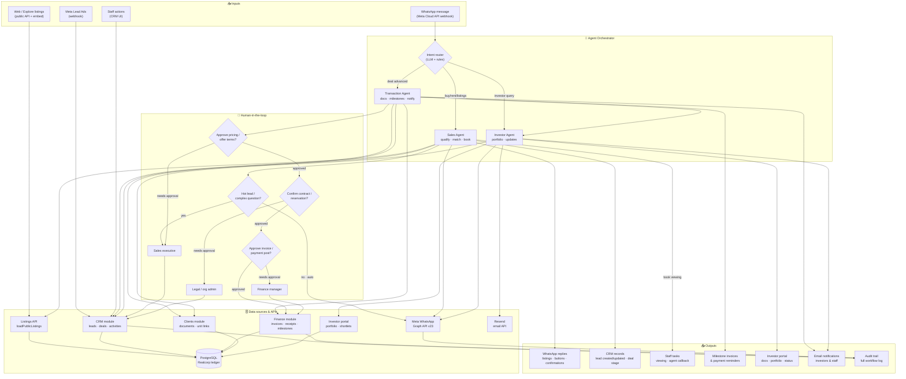

# Realcorp Agent Workflow Diagram

**For:** Future Caribbean 2026 application — workflow diagram upload  
**Paste link option:** Render this Mermaid at [mermaid.live](https://mermaid.live) and share the link, or export PNG/SVG from there.

---

## How to submit

1. Open [mermaid.live](https://mermaid.live)
2. Paste the contents of [`future-caribbean-workflow.mmd`](./future-caribbean-workflow.mmd)
3. Click **Actions → Export PNG** or **Export SVG**
4. Upload the file (max 10 MB), **or** copy the shareable link from mermaid.live

---

## Diagram (Mermaid)

---

## Legend

| Section | What it shows |
|---|---|
| **Inputs** | WhatsApp, Meta Lead Ads, public listings, staff CRM actions |
| **Agent orchestration** | Intent router → Sales / Transaction / Investor agents |
| **Human-in-the-loop** | Escalation and approval gates before pricing, contracts, invoices |
| **Data sources & APIs** | PostgreSQL ledger, Realcorp modules, WhatsApp Graph API, Resend |
| **Outputs** | Replies, CRM updates, tasks, finance, portal, email, audit log |
| **Decision points** | Diamond nodes: hot lead?, approve pricing?, confirm contract?, approve invoice? |

---

## End-to-end example (Bo Properties)

1. **Input:** Diaspora prospect WhatsApps “I want a 2-bed in Lagos under ₦50M”
2. **Router:** Sales Agent
3. **Data:** Queries listings API + CRM (existing lead match by phone)
4. **Decision:** Budget fit → auto-send 3 listings; complex financing → escalate to sales exec
5. **Output:** WhatsApp listing cards + lead updated + viewing task if booked
6. **Transaction Agent:** Deal moves to reservation → document checklist → **legal approves** → milestone invoice draft → **finance approves** → send
7. **Investor Agent:** Linked investor gets portal update + optional email/WhatsApp nudge
